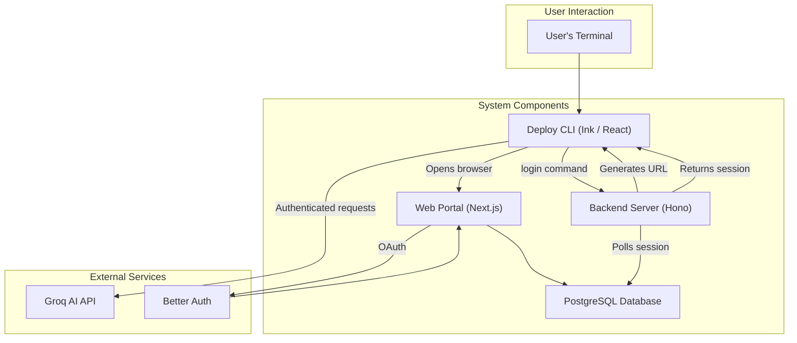

# Deploy CLI

A professional AI-powered Command Line Interface for the Next Generation of Developers.  
面向下一代开发者的专业级 AI 驱动命令行界面。

[](./LICENSE)
[](https://github.com/abdulwasea89/DeployCli)
[](./Dockerfile)
[](./CONTRIBUTING.md)
[](https://github.com/abdulwasea89/DeployCli/actions)
[](https://nodejs.org/)
[](https://www.typescriptlang.org/)

[English](./README.md) | [简体中文](./README_zh-CN.md)

---

## Overview

**Deploy CLI** is a high-performance terminal assistant that brings state-of-the-art AI reasoning directly to your workflow. Built with a "Terminal First" philosophy, it combines the flexibility of React/Ink with the power of Groq's low-latency inference, featuring secure authentication, file context inclusion, and a beautiful glassmorphism-inspired interface.

---

## Who am I and why I built this

Hi there! I'm Abdul Wasea, a passionate software developer who spends most of my day in the terminal. For years, I've been frustrated with the disconnect between powerful AI tools and the command-line environment where I do most of my work.

I built Deploy CLI because I wanted an AI assistant that feels like a natural extension of my terminal workflow. No more switching between browser tabs, copying code snippets, or losing context when asking AI for help. This tool lives where I live — in the terminal.

My goal is to create something that not only solves real developer problems but also demonstrates how AI can be deeply integrated into our daily development workflows. Every feature in Deploy CLI was born from my own frustrations and the desire to build something I'd want to use every day.

---

## 我是谁，为什么构建这个项目

你好！我是 Abdul Wasea，一名充满热情的软件开发者，我的大部分时间都在终端中度过。多年来，我一直对强大的 AI 工具与我主要工作的命令行环境之间的脱节感到沮丧。

我构建 Deploy CLI 是因为我想要一个感觉像是终端工作流程自然延伸的 AI 助手。不再需要在浏览器标签页之间切换、复制代码片段，或在向 AI 寻求帮助时丢失上下文。这个工具生活在我生活的地方 — 在终端中。

我的目标是创建一个不仅能解决真正开发者问题的东西，还要展示 AI 如何深度集成到我们的日常开发工作流程中。Deploy CLI 中的每个功能都源于我自己的挫败感，以及构建一个我每天都想使用的工具的愿望。

---

## Key Features

### AI & Reasoning

- **Deep Reasoning**: Native support for `gpt-oss-120b` for complex problem solving with real-time reasoning display
- **File Context**: Include files in conversations using `@filename` syntax for context-aware responses
- **Streaming Responses**: Real-time text and reasoning streaming for responsive interactions
- **Session Persistence**: Automatic session recovery and chat history preservation

### User Experience

- **Premium Aesthetics**: Aesthetically pleasing TUI with Amber/Black glassmorphism-inspired design
- **Interactive Commands**: Rich command system (`/login`, `/clear`, `/help`, `/logout`, `/exit`)
- **Multi-language**: Full English and Chinese language support
- **Terminal First**: Optimized for developers who live in the terminal

---

## Architecture

Deploy CLI is designed with a decoupled, multi-component architecture to ensure scalability and maintainability.

### Design Pillars

- **Enterprise Modular**: Decoupled architecture for easy extension and plugin development
- **Container Native**: First-class support for Docker and Docker Compose with complete containerization
- **Secure Authentication**: Integrated OAuth-based authentication with secure token management
- **High Performance**: Built with modern Node.js, TypeScript, and optimized for low-latency responses

### System Overview

It consists of three main parts: the CLI, a backend server for authentication, and a web-based portal for login.



### Components

- **CLI Application (`src/`)**: Built with **Ink** and **React**, this is the main interface where users interact with the AI. It manages the UI, handles user input, and communicates with the backend services.
- **Backend Server (`src/server/`)**: A lightweight **Hono** server responsible for handling the authentication flow. It communicates with the web portal and the database to verify user sessions.
- **Web Portal (`web/`)**: A **Next.js** application that provides a web-based interface for users to log in and authenticate via **Better Auth**.
- **Database (`docker-compose.yml`)**: A **PostgreSQL** database used to store user sessions and other application data.

### Authentication Flow

1.  The user runs the `/login` command in the CLI.
2.  The CLI sends a request to the backend server to initiate the authentication process.
3.  The backend server generates a unique authentication code and a URL for the web portal, which it sends back to the CLI.
4.  The CLI opens the URL in the user's default browser.
5.  The user logs in through the web portal, which uses **Better Auth** to handle the OAuth flow.
6.  Once authenticated, the web portal stores the user's session token in the PostgreSQL database.
7.  Meanwhile, the backend server polls the database to check for the session token.
8.  Once the token is found, the backend server sends it to the CLI, completing the authentication process.
9.  The CLI can then make authenticated requests to the **Groq AI API**.

## Project Structure

```text
.
├── assets/           # Brand assets & design guidelines
├── bin/              # Executable binaries for the CLI application
├── config/           # Multi-environment configurations for the application
│   ├── constants.ts     # App constants and shared configuration values
│   └── environments/    # Environment-specific configs (e.g., development, production)
├── docs/             # Technical documentation, guides, and architectural diagrams
├── scripts/          # Automation scripts for tasks like database management
├── src/              # Main application source code for the CLI
│   ├── components/   # Reusable React/Ink UI components for the terminal interface
│   │   ├── ChatHistory.tsx  # Component for displaying the message history
│   │   ├── ChatInput.tsx    # Component for user input and command handling
│   │   └── Header.tsx       # Component for the application header and branding
│   ├── hooks/        # Custom React hooks for state management and logic
│   │   └── useChat.ts       # Core hook for managing chat state and API interactions
│   ├── services/     # Business logic and integrations with external APIs
│   │   ├── aiService.ts     # Service for interacting with the Groq AI API
│   │   └── auth/            # Services for handling user authentication
│   ├── types/        # TypeScript type definitions and interfaces
│   ├── server/       # Backend API server (Hono) for handling authentication
│   ├── lib/          # Shared utilities, libraries, and helper functions
│   ├── middleware/   # Middleware for the backend server requests
│   ├── schemas/      # Data validation schemas using Zod
│   └── themes/       # UI themes, styles, and color definitions
├── web/              # Next.js application for the authentication web portal
├── tests/            # Automated tests for the application
│   ├── integration/     # Integration tests for combined components
│   └── unit/           # Unit tests for individual components and functions
├── Dockerfile        # Configuration for building the Docker container
├── docker-compose.yml # Docker Compose configuration for multi-service orchestration
└── package.json     # Node.js project metadata, dependencies, and scripts
```

## Quick Start

### Prerequisites

- **Node.js 20+**
- **npm or yarn**
- **Docker & Docker Compose** (recommended for full setup)

### Local Development / 本地开发

#### 1. Clone and Setup / 克隆项目

```bash
# Clone the repository
git clone https://github.com/abdulwasea89/DeployCli.git
cd DeployCli

# Install dependencies
npm install
```

#### 2. Environment Configuration / 环境配置

```bash
# Copy environment template
cp .env.example .env

# Edit .env with your configuration
# Required: GROQ_API_KEY, DATABASE_URL, etc.
```

#### 3. Database Setup / 数据库设置

```bash
# Start PostgreSQL database
docker-compose up -d db

# Initialize database schema
npm run db:init
```

#### 4. Start the Application / 启动应用

```bash
# Terminal 1: Start the backend API server
npm run server

# Terminal 2: Start the authentication web portal
cd web && npm install && npm run dev

# Terminal 3: Start the CLI application
npm run dev
```

For a more detailed guide on setting up the development environment, see the [Development Setup Guide](./docs/development.md).

### Docker Deployment / Docker 部署

```bash
# Build and run with Docker Compose
docker-compose up --build

# Or run CLI only
docker-compose run --rm deploy-cli
```

## Usage Guide

### Authentication

```bash
# Start the CLI
npm run dev

# In the CLI, type:
/login
```

This will open your browser for authentication via the web portal at `http://localhost:3000`.

### Chat Commands

```
/help          # Show available commands
/login         # Authenticate with the service
/logout        # Clear current session
/clear         # Clear chat history
/exit          # Exit the application
```

### File Context

Include files in your conversations for context-aware AI responses:

```
Tell me how to optimize this code @src/components/ChatInput.tsx
```

## API Reference

### Authentication Endpoints / 认证端点

#### POST `/api/auth/*`

Better Auth OAuth endpoints for user authentication.

#### POST `/custom/auth/initiate`

Initiate authentication flow.

```json
// Response
{
  "code": "A1B2C3D4",
  "url": "http://localhost:3000/login?CODE=A1B2C3D4"
}
```

#### POST `/custom/auth/verify`

Verify authentication code.

```json
// Request
{
  "code": "A1B2C3D4",
  "userId": "user_123",
  "sessionToken": "token_here"
}
```

#### GET `/custom/auth/poll?code={code}`

Poll authentication status.

#### POST `/custom/auth/validate`

Validate session token.

## Tech Stack

### Frontend & CLI

- **[Ink](https://github.com/vadimdemedes/ink)** - React for interactive CLIs
- **[React 19](https://react.dev/)** - UI framework
- **[Next.js 16](https://nextjs.org/)** - Web authentication portal

### Backend & Services

- **[Hono](https://hono.dev/)** - Lightweight API framework
- **[Better Auth](https://better-auth.com/)** - Authentication library
- **[PostgreSQL](https://postgresql.org/)** - Primary database
- **[Redis](https://redis.io/)** - Session storage (optional)

### AI & Data Processing

- **[Groq](https://groq.com)** - Ultra-fast AI inference
- **[Vercel AI SDK](https://vercel.com/docs/ai)** - AI integration framework
- **[Zod](https://zod.dev)** - Schema validation

### Development & Deployment

- **[TypeScript 5.9+](https://www.typescriptlang.org/)** - Type safety
- **[Docker](https://www.docker.com/)** - Containerization
- **[ESLint](https://eslint.org/)** - Code linting
- **[tsx](https://tsx.is/)** - TypeScript execution

## Testing

```bash
# Run unit tests
npm test

# Run integration tests
npm run test:integration

# Run all tests with coverage
npm run test:coverage
```

## Contributing

Contributions are extremely welcome! Please read our [Contributing Guide](./CONTRIBUTING.md) to get started.

### Development Workflow

1. Fork the repository
2. Create a feature branch: `git checkout -b feature/your-feature`
3. Make your changes and add tests
4. Run tests: `npm test`
5. Submit a pull request

### Code Standards

- **TypeScript**: Strict type checking enabled
- **ESLint**: Automated code linting and formatting
- **Pre-commit hooks**: Automated testing and linting
- **Conventional commits**: Standardized commit messages

## Documentation

- **[Development Setup](./docs/development.md)** - Detailed guide for setting up the dev environment
- **[Architecture](./docs/architecture.md)** - System design and component overview
- **[API Documentation](./docs/api/)** - Backend API specifications
- **[Contributing Guide](./CONTRIBUTING.md)** - Development guidelines
- **[Brand Guidelines](./assets/brand_guidelines.md)** - Design and branding standards

## Troubleshooting

### Common Issues / 常见问题

**CLI won't start / CLI 无法启动**

```bash
# Check Node.js version
node --version  # Should be 20+

# Clear node_modules and reinstall
rm -rf node_modules package-lock.json
npm install
```

**Authentication fails / 身份验证失败**

```bash
# Ensure backend server is running
npm run server

# Check database connection
docker-compose ps
docker-compose logs db
```

**Docker build fails / Docker 构建失败**

```bash
# Clean Docker cache
docker system prune -a

# Rebuild without cache
docker-compose build --no-cache
```

## License

This project is licensed under the MIT License - see the [LICENSE](./LICENSE) file for details.

## Contributors

<a href="https://github.com/abdulwasea89/DeployCli/graphs/contributors">
  
</a>

## Acknowledgments

- **Groq** for providing ultra-fast AI inference
- **Vercel** for the AI SDK and Next.js
- **Ink** for the amazing CLI framework
- **Better Auth** for seamless authentication

## Star History

[](https://www.star-history.com/#abdulwasea89/DeployCli&type=date&legend=top-left)

---

<div align="center">
  <p>Built with ❤️ by <a href="https://github.com/abdulwasea89">Abdul Wasea</a></p>
  <p>Deploy CLI is open source software licensed under the <a href="./LICENSE">MIT License</a>.</p>
</div>
